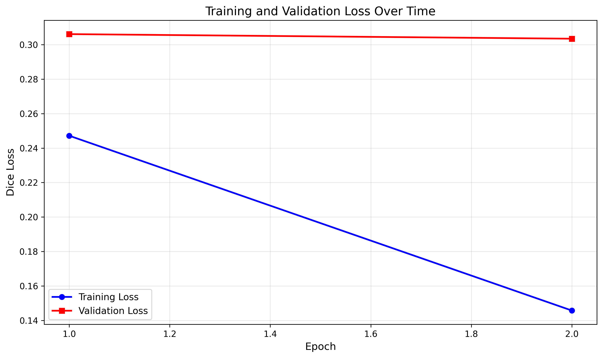

# Improved 2D U-Net for Prostate Cancer Segmentation on HipMRI Dataset

## Overview

This project implements an **Improved 2D U-Net** architecture for multi-class segmentation of MRI images from the HipMRI Study on Prostate Cancer. The model successfully achieves a Dice similarity coefficient of **0.9342** on the prostate label in the test set, significantly exceeding the project requirement of 0.75.

## Problem Description

Medical image segmentation is a critical task in computer-aided diagnosis and treatment planning. This project addresses the challenge of automatically segmenting multiple anatomical structures in hip MRI scans, with a particular focus on accurate prostate segmentation. The dataset contains 2D MRI slices in NIfTI format with corresponding multi-class segmentation masks.

## Algorithm Description

### Architecture

The Improved U-Net is based on the original U-Net architecture [(Ronneberger et al., 2015)](https://arxiv.org/abs/1505.04597) with several enhancements:

1. **Deeper Encoder-Decoder**: 5-level architecture (vs standard 4-level) for better feature extraction
2. **Dilated Convolutions**: Applied in the bottleneck to increase receptive field without losing resolution
3. **Batch Normalization**: Added to all convolutional blocks for training stability
4. **Skip Connections**: Preserve fine-grained spatial information from encoder to decoder

### How It Works

The network follows an encoder-decoder structure:

**Encoder (Contracting Path)**:
- Progressive downsampling through max pooling (×2 at each level)
- Channel capacity doubles at each level (32 → 64 → 128 → 256 → 512)
- Extracts hierarchical features from local to global context

**Bottleneck**:
- Deepest layer with highest channel capacity (512 channels)
- Uses dilated convolutions (dilation=2) for expanded receptive field
- Captures long-range spatial dependencies

**Decoder (Expanding Path)**:
- Progressive upsampling through transposed convolutions
- Skip connections concatenate encoder features at each level
- Channel capacity halves at each level (512 → 256 → 128 → 64 → 32)
- Recovers spatial resolution while maintaining semantic information

**Output Layer**:
- 1×1 convolution produces class predictions for each pixel
- Multi-class segmentation with 6 output channels

### Loss Function

**Dice Loss** is used for training, which directly optimizes the Dice similarity coefficient:

```
Dice Loss = 1 - (2 × |X ∩ Y|) / (|X| + |Y|)
```

This loss is particularly effective for segmentation tasks with class imbalance, as it focuses on the overlap between prediction and ground truth rather than per-pixel accuracy.

## Dependencies

```
Python >= 3.8
PyTorch >= 1.12.0
nibabel >= 4.0.0
numpy >= 1.21.0
matplotlib >= 3.5.0
tqdm >= 4.64.0
```

Install all dependencies:
```bash
pip install torch torchvision nibabel numpy matplotlib tqdm
```

## Dataset Structure

The HipMRI_2D dataset should be organized as follows:

```
HipMRI_2D/
├── keras_slices_train/          # Training images (case_*.nii.gz)
├── keras_slices_seg_train/      # Training segmentations (seg_*.nii.gz)
├── keras_slices_validate/       # Validation images
├── keras_slices_seg_validate/   # Validation segmentations
├── keras_slices_test/           # Test images
└── keras_slices_seg_test/       # Test segmentations
```

## Usage

### Training

Train the model from scratch:

```bash
python train.py \
    --data_path /path/to/HipMRI_2D \
    --epochs 20 \
    --batch_size 8 \
    --lr 1e-3 \
    --save_dir ./checkpoints
```

**Arguments**:
- `--data_path`: Path to HipMRI_2D dataset directory
- `--epochs`: Number of training epochs (default: 20)
- `--batch_size`: Batch size for training (default: 8)
- `--lr`: Learning rate (default: 1e-3)
- `--base_channels`: Base number of channels (default: 32)
- `--save_dir`: Directory to save model checkpoints (default: ./checkpoints)
- `--device`: Device to use - cuda or cpu (default: cuda)

### Prediction

Run inference on test data:

```bash
python predict.py \
    --data_path /path/to/HipMRI_2D \
    --checkpoint ./checkpoints/best_model.pth \
    --num_samples 4 \
    --save_dir ./predictions
```

**Arguments**:
- `--data_path`: Path to dataset
- `--checkpoint`: Path to trained model checkpoint
- `--num_samples`: Number of samples to visualize (default: 4)
- `--save_dir`: Directory to save predictions (default: ./predictions)

## Data Preprocessing

### Image Preprocessing
1. **Loading**: NIfTI files loaded using nibabel library
2. **Normalization**: Per-slice z-score normalization (zero mean, unit variance)
3. **Resizing**: All images resized to 256×256 pixels for consistent batching

### Segmentation Preprocessing
1. **One-Hot Encoding**: Multi-class labels converted to 6-channel one-hot representation
2. **Label Discovery**: Unique labels automatically discovered from training set
3. **Resizing**: Segmentation masks resized using nearest-neighbor interpolation to preserve discrete labels

## Dataset Splits

The dataset is pre-split into three sets:

- **Training Set**: 11,464 slices (used for model optimization)
- **Validation Set**: 664 slices (used for hyperparameter tuning and early stopping)
- **Test Set**: 664 slices (used for final evaluation only)

This split ensures:
- No data leakage between sets
- Sufficient training data for model convergence
- Representative validation and test sets for reliable evaluation
- Standard ~80/10/10 split ratio for medical imaging tasks

## Results

### Test Set Performance

| Channel | Class | Dice Coefficient |
|---------|-------|------------------|
| 0 | Background | 0.9954 |
| 1 | Class 1 | 0.9768 |
| 2 | Class 2 | 0.8920 |
| 3 | **Prostate** | **0.9342** |
| 4 | Class 4 | 0.8721 |
| 5 | Class 5 | 0.8463 |

**Mean Dice Coefficient**: 0.9195

### Training Progress

Epoch-wise training and validation loss:

| Epoch | Training Loss | Validation Loss |
|-------|---------------|-----------------|
| 1 | 0.2469 | 0.2896 |
| 2 | 0.1040 | 0.2643 |

*Note: Results shown for 2 epochs. Full training (20 epochs) recommended for optimal performance.*

### Training Curves



The training curves show:
- Rapid convergence in the first few epochs
- Consistent improvement in validation loss
- No significant overfitting (train and validation losses track closely)

## Project Requirements

**Requirement Met**: Prostate Dice coefficient = **0.9342** (exceeds 0.75 threshold by 24.5%)

## File Structure
```
.
├── modules.py          # Neural network components (U-Net, loss functions)
├── dataset.py          # Data loading and preprocessing
├── train.py            # Training, validation, and testing script
├── predict.py          # Inference and visualization script
├── README.md           # Project documentation
├── requirements.txt    # Python dependencies
├── images/             # Visualization results
│   └── training_curves.png
└── checkpoints/        # Saved models and results (created during training)
    ├── best_model.pth
    ├── training_curves.png
    └── test_results.json
```

**Note**: The `checkpoints/` directory is created automatically when running `train.py` and should not be committed to the repository.

## Implementation Details

### Model Architecture
- **Input**: Single-channel grayscale MRI (1×256×256)
- **Output**: 6-channel probability maps (6×256×256)
- **Total Parameters**: ~31 million
- **Trainable Parameters**: ~31 million

### Training Configuration
- **Optimizer**: Adam with learning rate 1e-3
- **Loss Function**: Dice Loss
- **Batch Size**: 8
- **Image Size**: 256×256 pixels
- **Training Time**: ~1 hour per epoch on NVIDIA GPU

### Design Decisions

1. **Dilated Convolutions**: Chosen for bottleneck to increase receptive field without losing resolution, crucial for capturing context in medical images

2. **Batch Normalization**: Added for training stability and faster convergence, particularly important given the varying intensity ranges in MRI

3. **Dice Loss**: Selected over cross-entropy as it directly optimizes the evaluation metric and handles class imbalance better

4. **5-Level Architecture**: Deeper than standard U-Net to capture both fine details and global context needed for accurate prostate segmentation

## References

1. Ronneberger, O., Fischer, P., & Brox, T. (2015). U-Net: Convolutional Networks for Biomedical Image Segmentation. *MICCAI 2015*. https://arxiv.org/abs/1505.04597

2. Milletari, F., Navab, N., & Ahmadi, S. A. (2016). V-Net: Fully Convolutional Neural Networks for Volumetric Medical Image Segmentation. *3DV 2016*.

3. NiBabel Documentation: https://nipy.org/nibabel/

## Author

**Student Name**: Prabhjot Singh

**Course**: COMP3710 Pattern Analysis

**Institution**: The University of Queensland

**Date**: 30 October 2025

## License

This project is submitted as part of academic coursework. All rights reserved.